# Gona Launcher

<p align="center">
  <a href="#video"></a>
  <br><sub>The launcher running, under a minute (<a href="#video">full video</a>).</sub>
</p>

**Highly configurable, and made to fit you: one tap of Super away.** Gona Launcher is an app launcher for
[Omarchy](https://omarchy.org): put your apps in tiles you split, colour and arrange yourself, and open them all
with a single tap of Super.

- **Yours to arrange.** Group apps the way you think (Work, Social, Games, Create). Split a tile right or down and
  give every group its own colour.
- **Ready in seconds.** Start from a ready-made profile (Omarchy, Top, Dock, Focus or Clean) and change whatever you like.
- **Find anything fast.** Just start typing to filter your tiles, or press Ctrl+A for every installed app.
- **Opens with style.** Twenty opening effects, from a soft fade to Genie, Matrix and Fireworks, and a switch to reduce the motion.
- **Fits how you work.** A centred window, a panel on any edge, or full screen.
- **One setup per mood.** Save profiles for work, games or study and switch with one key.
- **Matches your desktop.** Dark and Light looks that follow your Omarchy theme, with every colour editable.

Built with [Quickshell](https://quickshell.org) as an Omarchy shell plugin.

## Install

```sh
omarchy plugin add https://github.com/Mgldvd/gona-launcher.git --enable
```

Requires **Omarchy 4.0** (its `omarchy-shell` with shell plugins, `omarchy plugin …`); built and checked with
**Quickshell 0.3.1**, Qt 6.11 and Hyprland 0.56, on Arch. The plugin needs nothing else at run time: the effect
shader ships compiled. To change the shader you also need `qsb` (package `qt6-shadertools`).

Update it with `omarchy plugin update gona.launcher` (see the [changelog](CHANGELOG.md); if the launcher looks unchanged
afterwards, `omarchy restart shell`). This is the `dev` branch (source, docs, tests); `master` holds
only the installable plugin. To work on the plugin from a clone of this repo, see
[development](docs/development.md) (`tools/install.sh`).

**Press and release Super alone** to open it: on the first start a switch (on by default) adds that binding to
`~/.config/hypr/bindings.lua` (a marked block of its own). Change it, point it at "All apps" or turn it off in
⚙ > Keys, the first row. Add the bar button in Omarchy's settings (Bar) or with `omarchy plugin enable gona.launcher
<section>`. Right-click on the bar button
opens a small menu (Settings, Reload, About and the version), middle click opens straight into "All apps"; see [using it](docs/usage.md).

## Video

https://github.com/user-attachments/assets/9bc50db2-94d1-4847-b65a-ac4e07d48a73

## Screenshots

<table>
  <tr>
    <td width="50%">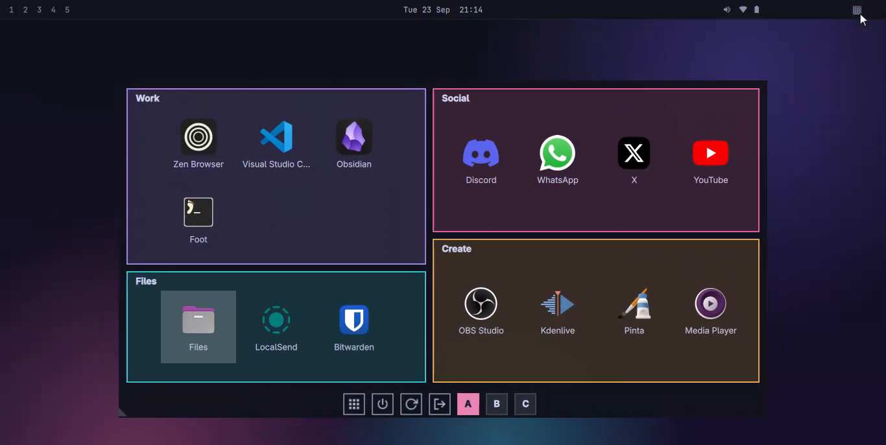<br><sub><b>Tiles.</b> Group your apps, name and colour each tile.</sub></td>
    <td width="50%">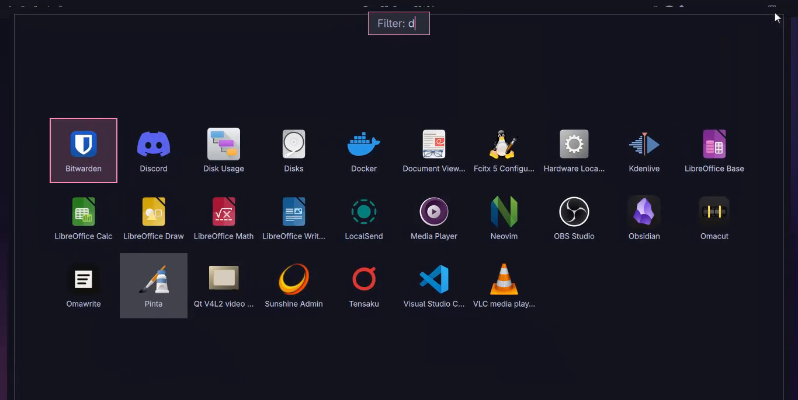<br><sub><b>Type to filter</b> the apps in your tiles.</sub></td>
  </tr>
  <tr>
    <td>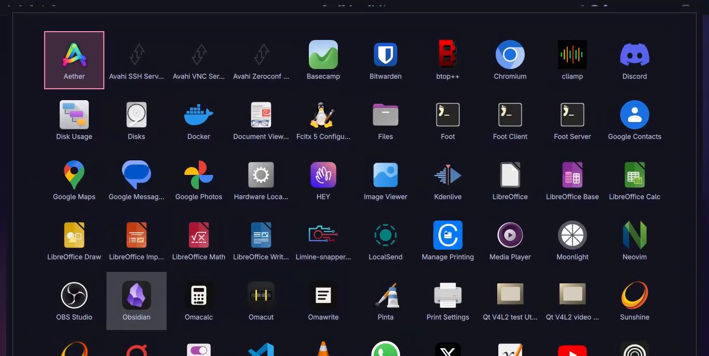<br><sub><b>All apps.</b> Every installed app, one button away.</sub></td>
    <td>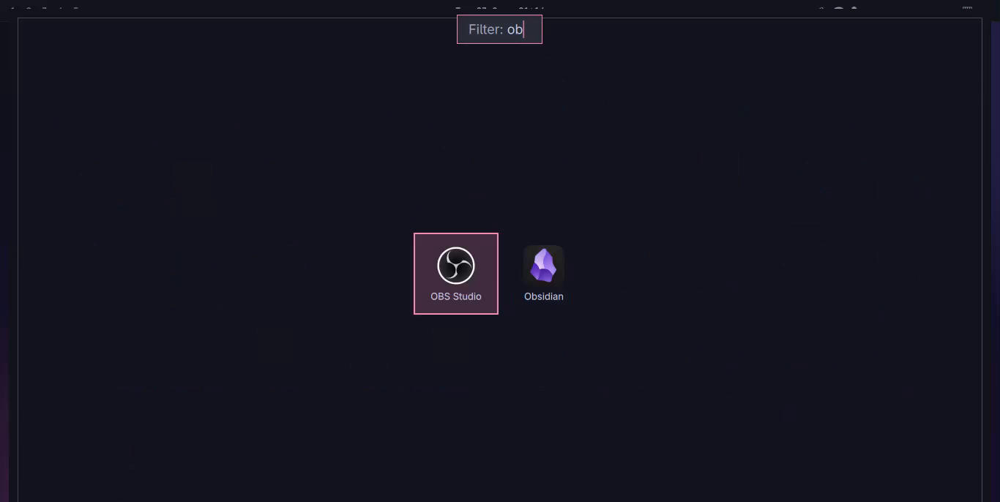<br><sub><b>Search</b> among all installed apps.</sub></td>
  </tr>
  <tr>
    <td>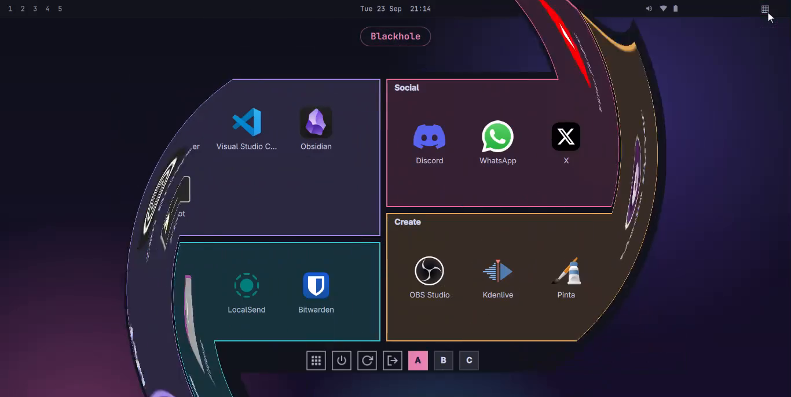<br><sub><b>Opening effects.</b> Twenty of them, here Blackhole.</sub></td>
    <td>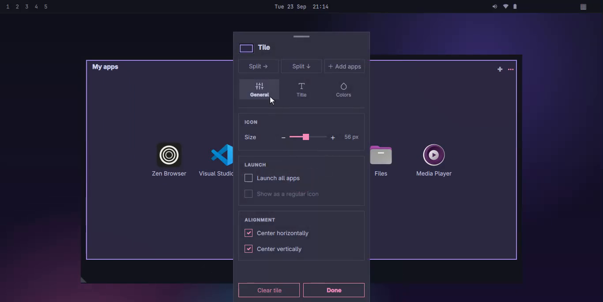<br><sub><b>Tile menu.</b> Split, add apps, icon size, title, colours.</sub></td>
  </tr>
  <tr>
    <td>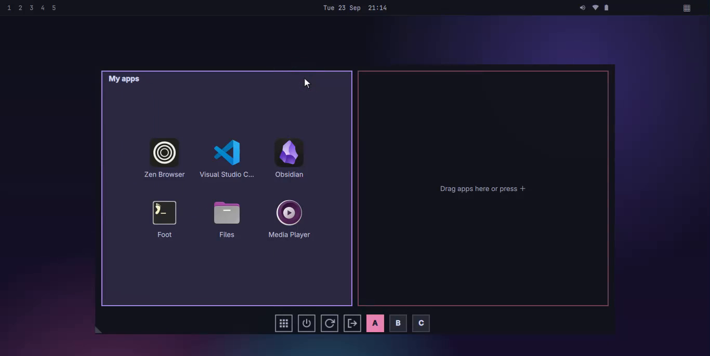<br><sub><b>Split</b> a tile right or down, drag apps in.</sub></td>
    <td>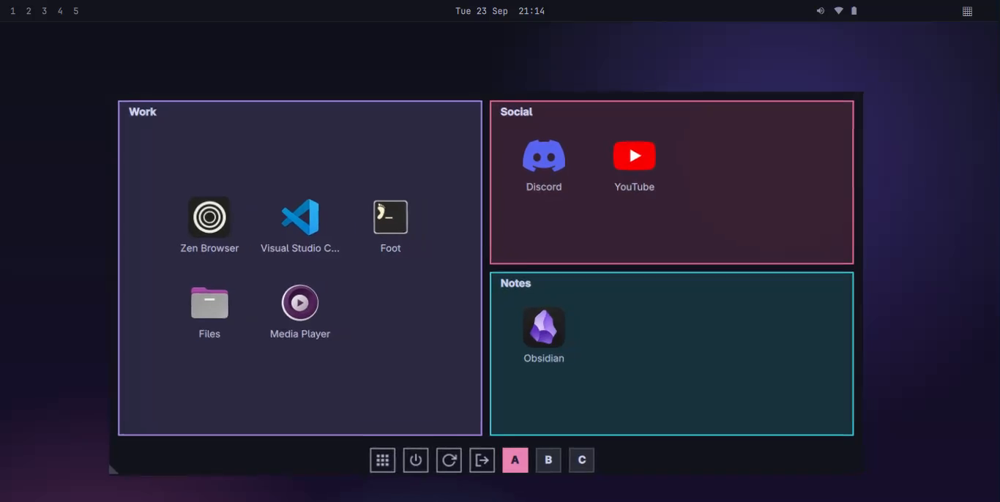<br><sub><b>Colours.</b> A border and background for every tile.</sub></td>
  </tr>
  <tr>
    <td>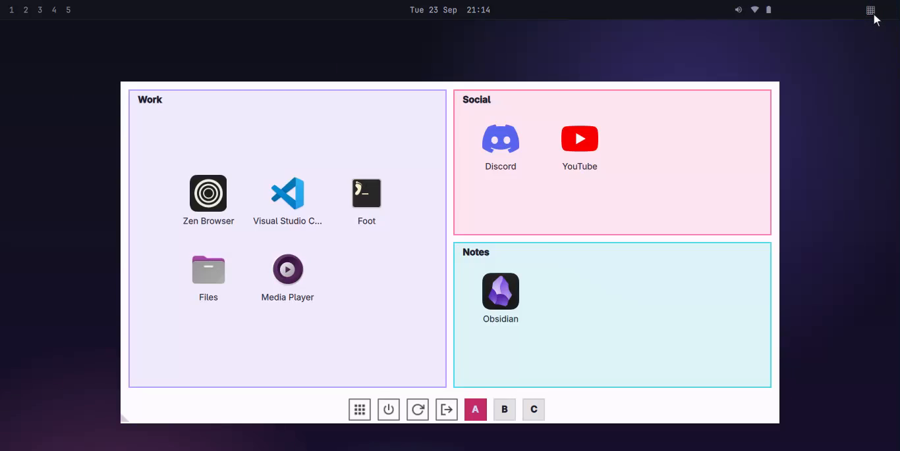<br><sub><b>Dark and Light</b>, or following the Omarchy theme.</sub></td>
    <td>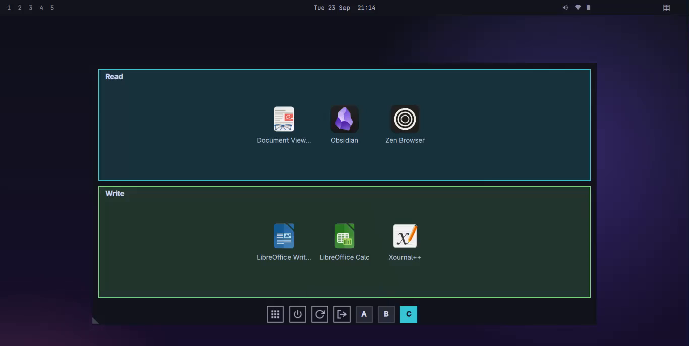<br><sub><b>Profiles.</b> Several saved setups, one key each.</sub></td>
  </tr>
  <tr>
    <td>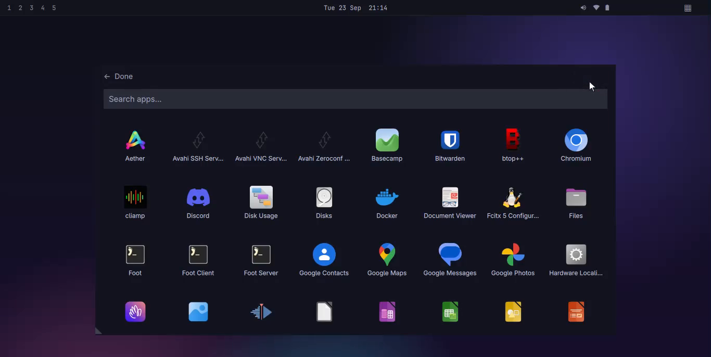<br><sub><b>Add apps</b> to a tile from every installed app.</sub></td>
    <td>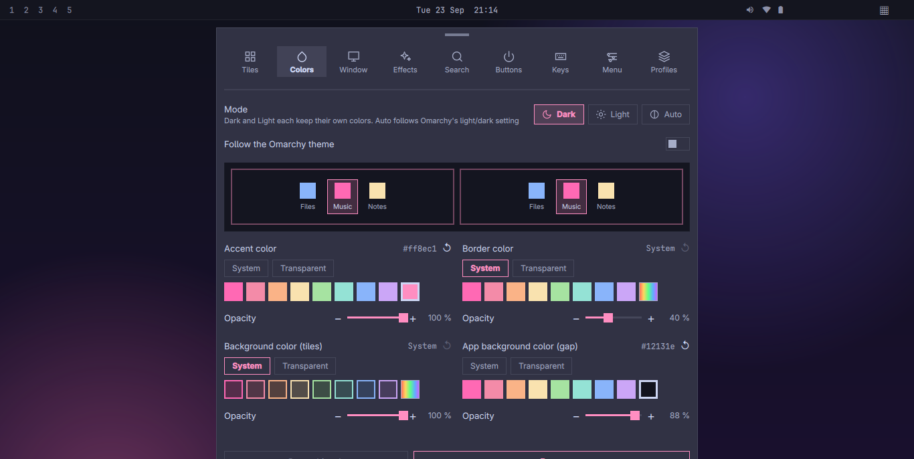<br><sub><b>Settings.</b> Nine tabs, a live preview in each.</sub></td>
  </tr>
  <tr>
    <td colspan="2" align="center">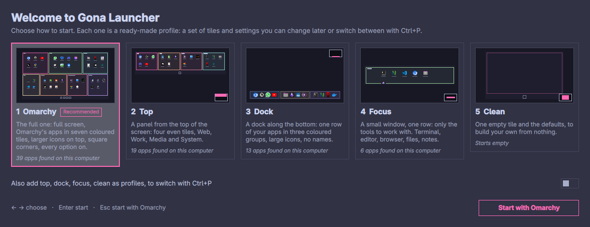<br><sub><b>Ready-made profiles.</b> Start from Omarchy, Top, Dock, Focus or Clean; the others can be added as profiles.</sub></td>
  </tr>
</table>

Guides in [`docs/`](docs/README.md): [using it](docs/usage.md), [effects](docs/effects.md),
[configuration](docs/configuration.md), [architecture](docs/architecture.md), [development](docs/development.md).

## Uninstall

```sh
omarchy plugin remove gona.launcher
```

Before removing it, set ⚙ > Keys > "Open with Super" to **Off** (or delete the `gona-launcher:super` block from
`~/.config/hypr/bindings.lua`), and remove the bar button and any other keybinding you added for it. Your settings and tiles are not part of the plugin and
stay behind; delete them too if you want a clean slate:

```sh
rm -r ~/.config/gona-launcher ~/.local/state/gona-launcher    # config.toml, profiles, usage counts
```

## Layout

| Path | What it is |
| --- | --- |
| `manifest.json` | The Omarchy plugin manifest (id `gona.launcher`, kinds `overlay` + `bar-widget`) |
| `LICENSE`, `LICENSE-MIT`, `LICENSE-APACHE` | The licenses (see [License](#license)) |
| `preview.png` | The picture the plugin marketplace shows |
| `app/Overlay.qml` | State and logic (settings, layout tree, filter, keyboard selection, show/hide) and the launcher's windows |
| `app/BarWidget.qml` | The bar button that opens it |
| `app/launcher/` | What is drawn in the launcher: `LauncherContent` (tiles, filter, strip, keyboard), `Node` (a tile or a split, recursively), `AppCell` (one app icon), `SearchResults` (matches among all apps), `Picker` (the "add apps" grid), `ProfileButton`, and `FxLayer` (draws the [opening effects](docs/effects.md)) |
| `app/menus/` | The ⚙ menu (`OptionsMenu`) and the ⋯ menu of one tile (`TileMenu`), `ColorField`, `ProfilePicker`, `ConfigTransfer` (Export / Import of `config.toml`) and `Welcome` (the presets on the first start) |
| `app/presets/` | The presets, in the format of `config.toml` |
| `app/menus/controls/` | The menus' building blocks: toggles, choices, buttons, tabs, `SliderRow`, focus ring |
| `app/menus/previews/` | The live mini pictures at the top of ⚙ > Tiles, Colors, Window, Effects (it plays the effect) and Buttons |
| `app/lib/` | Pure logic with no state: `layout.js` (tree edits, tile sizing), `keys.js`, `colors.js`, `fx.js` (effect curves and geometry), `toml.js` / `config.js` (the config file: a small TOML reader/writer and the map between settings and file sections); `tests/logic.test.mjs` tests them directly with Node |
| `app/shaders/` | The effect shader, `fx.frag`, compiled to the committed `fx.frag.qsb` by `tools/build-shaders.sh` |
| `app/assets/icons/` | The launcher icon and the seven strip button styles (`themes/<style>/`) |
| `tests/verify.sh` | Validates the manifest, runs the logic unit tests and checks the compiled shader is current |
| `tests/ui.sh` | The interface tests, in a throw-away Quickshell instance (see [development](docs/development.md)) |
| `tools/` | `install.sh` (copies the plugin to the shell's folder), `build-shaders.sh`, and `promo/` (records the README video) |
| `docs/` | Usage, configuration, effects, architecture and development notes, and `TODO.md` |

Settings and tiles are saved in one file, `~/.config/gona-launcher/config.toml` (plain TOML: edit it by hand while the launcher is closed). ⚙ > Profiles > Configuration file exports it to any path and imports one back, keeping the previous settings in `config.toml.bak`. Profiles (⚙ > Profiles) keep several such files under `~/.config/gona-launcher/profiles/`; switch in the menu or open the launcher on one with `omarchy-shell shell summon gona.launcher '{"profile":"work"}'`. An older install's `window.json` and `layout.json` are read once and converted.

## Power button icons

The power buttons and the "All apps" button come in seven styles, chosen in ⚙ > Buttons > "Button
style": Square line (thin square outlines; the default), Grid (square, matching the launcher's icon), Pastel, Carbon, Line, Circle and Metro.
Each style is a folder `assets/icons/themes/<style>/` with four complete images, 256×256, background and
drawing included: `all-apps.svg`, `power-off.svg`, `restart.svg` and `logout.svg`. Replace any of them
with your own SVG of the same name; the app only scales it down to the button size and dims it slightly
until the pointer is over it. A new folder needs its name added to `iconThemes` in `app/Overlay.qml` to
appear in the menu.

Design notes, the traps found so far and the decisions behind them (including the move from the old Cinnamon/X11
build to this Omarchy plugin) are in [`.memory/`](.memory/index.md).

More in [`docs/`](docs/README.md): configuration, architecture and development.

## License

Dual-licensed under either the [Apache License 2.0](LICENSE-APACHE) or the [MIT License](LICENSE-MIT), at your option.
No third-party code is bundled; at run time the plugin uses the Omarchy shell, Quickshell and Qt that Omarchy provides.
